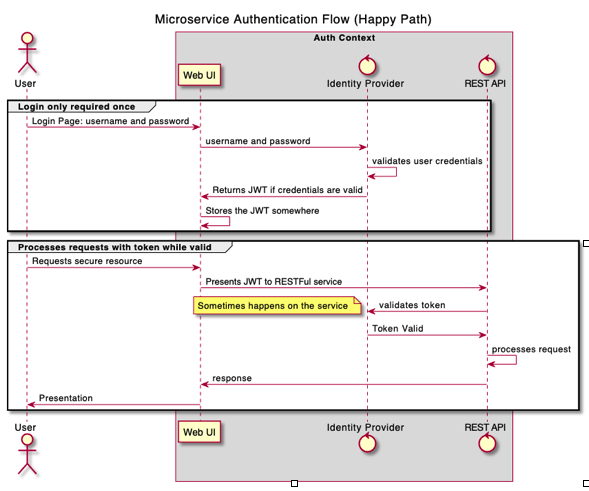

# gLab Security Client

Starter set of classes to implement the client for gLabIdentityProvider in Spring Boot

Note that this is a very rough implementation.  Its purpose is to get a security system set up quickly.  The intention is that students can build upon it, and possibly migrate to one of the 
commercial security services like OAUTH2, and Okta

## Steps to implement the client

### 1. Dependencies

Add the following dependencies to your `build.gradle` in your existing Spring Boot application...

```gradle
	implementation 'org.springframework.boot:spring-boot-configuration-processor'
	implementation 'org.springframework.boot:spring-boot-starter-security'
	implementation group: 'io.jsonwebtoken', name: 'jjwt', version: '0.9.0'
	implementation group: 'javax.xml.bind', name: 'jaxb-api', version: '2.3.1'
```

*We assume that you already have a working spring web application.  If not, you will need to add those dependencies.*

### 2. Copy Files
Copy the folders `configuration` and `security` to the `src/main/java` of your existing application.  The two packages / folders must exist at the same level as `*Application.java` which is the file that contains the main method used to start the Spring application.  NOTE: If you are using IntelliJ, it should automatically adjust the Java packages.  

> If you see a **Circular Reference** exception when running your tests, or the application, it may be due to the [`JwtProperties`](https://gitlab.galvanizelabs.net/-/ide/project/cohorts/sf/ase-apr-23/exercises/spring-security-client/tree/main/-/src/java/com/galvanize/security/SecurityCredentialsConfig.java/#L79) bean that is defined in the class [`SecurityCredentialsConfig`](https://gitlab.galvanizelabs.net/-/ide/project/cohorts/sf/ase-apr-23/exercises/spring-security-client/tree/main/-/src/java/com/galvanize/security/SecurityCredentialsConfig.java).  To fix this issue, move the `JwtProperties` bean to your `*Application` class.  NOTE: This doesn't always occur, but moving the bean will work even if you do not have the exception.  


### 3. Use it.
- [Identity Service API](./docs/IdentityService_openapi.yaml)
- Authentication Flow Diagram
- 

These files are intended to be used with the GLab Identity Provider.  Please ask your instructor if it's not in your GitLab group.

## Securing your application

Once implemented, Unless otherwise configured, the application will require authentication for all endpoints. 
Configuration can be done in the security configuration class, [`SecurityConfigurationConfig.java`](src/java/com/galvanize/security/SecurityCredentialsConfig.java) in this project.

in the `.configure(HttpSecurity)` method, beginning on line 47 you see the following code...

```java
.antMatchers("/**").authenticated()
```

This section is where config specific endpoints are configured.  For example, if you wanted to allow unauthenticated access to the `/health` endpoint, you would add the following line...

```java
.antMatchers("/health").permitAll()
```

.antMatchers() takes a list of endpoints, and the `.permitAll()` method allows unauthenticated access to the endpoint.

To require authentication for the `/health`, endpoint, you would add the following line...

```java
.antMatchers("/health").authenticated()
```
This line will require an authenticated user to access the endpoint. Note that the `/health` endpoint is already configured to require authentication.  This is just an example.

To require a specific role for this endpoint, you would add the following line...

```java
.antMatchers("/health").hasRole("ADMIN")
```

Endpoint security can also be done with annotations.  See the [Spring Classes and Method Security](./Securing-Classes-And-Methods.md) document for more information. 

To use annotations, you will need to add the following line to your `SecurityConfiguration.java` file...

```java
@EnableGlobalMethodSecurity(prePostEnabled = true)
```

With this annotation, you can use the `@PreAuthorize` annotation to secure your endpoints.  See the [Spring Classes and Method Security](./Securing-Classes-And-Methods.md) document for more information.

```java 
@GetMapping("/health")
@PreAuthorize("hasRole('ADMIN')")
public String health() {
    return "OK";
}
```

This method will now require an authenticated user with the role of `ADMIN` to access the endpoint.


## Unit Tests 

[Unit Tests with Security](./Unit-Test-Security.md)

## Integration tests

[Testing security with Integration Tests](./Integration-Test-Security.md)

## Securing Endpoints

[Spring Classes and Method Security](./Securing-Classes-And-Methods.md)


